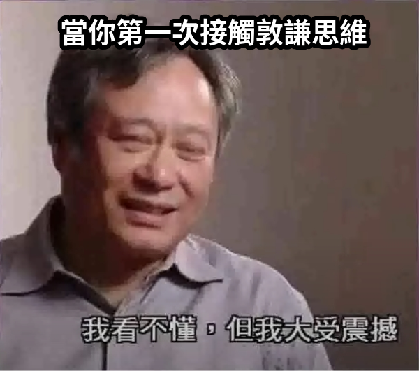

# how-to-think-more-dunqianer
運用敦謙思維讓你更像個敦謙人

## 簡介

本指南用意在於教導你如何運用敦謙思維思考，不被外界常見的觀念所束縛。敦謙思維沒有盡頭與終點，只有更敦謙，沒有最敦謙。讓我們在敦謙思維的道路上精益求精，從內而外成為一名真正的敦謙人！

## 觀念釐清

在接觸敦謙思維之前，大家在生活中一定接觸過各種觀念及方法，但很可惜的是，那些東西在敦謙思維中都是有害的，講直白一點，就是**一堆屁**，請把他們丟掉。本章節將會舉出幾個常見的錯誤觀念，並且說明以敦謙思維的角度來看，為何那些東西並不需要在乎。



準備好了嗎？那我們開始吧。

----

:-1: commit 要盡可能的拆分乾淨，而且 commit message 要寫清楚這顆 commit 到底做了什麼事情。如果有的話，加上相關參考資料。

:+1: 人生沒有那麼多時間，隨便 commit，反正能動就好；訊息一律 `no message`。沒辦法反查又如何，發生的事情就發生了，人生要往前看，改掉錯誤的地方就好。

----

:-1: 每當開發新需求的時候，也要預留一些時間，重構之前的程式碼，讓新需求能融入整體。

:+1: 全部 hard code 就好，先解決眼前的問題，後面就不關我的事情了。

----

:-1: 一個好的工程師創造三個工作機會

:+1: 一個好的工程師創造十個工作機會

----

:-1: 為了讓大家在資料庫結構上能夠共同開發，任何變更請使用 migration 進行

:+1: 請自己重新從測試站資料庫 dump……你說和正式資料庫版本不一致？沒差，能動就好

----

:-1: bearer token 時效不能太長，且要經常輪替

:+1: 百年 token 真香

----

:-1: 如果有 null 的查詢，我們就使用 `where column is null`

:+1: 如果有 null 的查詢，我們使用 `where column > 0`

----

:-1: 我們系統都為繞在相同的會員資料上，所以使用 OAuth 2.0，並且各系統建立自己的 user table 來存放資料

:+1: 我們系統都為繞在相同的會員資料上，所以使用 OAuth 2.0，並且在 OAuth 開發套件，各系統沒有自己的 user table，直接吃 OAuth 中心的資料，統一管理方便又快速。

----

:-1: 每個使用者會歸屬不同場所，所以在操作資料的時候，要記得加上 `where place = place_id`

:+1: 每個使用者會歸屬不同場所，所以直接幫你加上一個 global scope，強迫套用，不怕大家忘記加

----

:-1: doc comment 寫的好，IDE 和後人看了才不會一頭霧水

:+1: 命名就是最好的註解，看不懂是你英文爛。了不起幫你加上 `[type] [description]` 可以了吧？對，就真的是 `[type] [description]` 模板，想寫你自己去寫，我不寫

----

:-1: 雖然 PHP 很自由，但我們也不能濫用這個特性隨便幫物件加上屬性

:+1: 
  ```php
     $input = $something->inject($input);
     $input = $another->appendSomething($input);
  ```
你問我 `$input` 怎麼會有這個屬性？我他X怎麼知道

----

:-1: 有些關聯是重要資料（例如：場域），為了避免查詢速度緩慢，我們採用資料庫的實體分區功能來存放資料

:+1: 讓我們使用分表，把所有資料表都改成 n 份，各自查詢就不怕了……有需要集中的資料提供查詢？那再做一張合併表，prefix 使用 `all_`，之後分表改變請記得一併修改合併表。

----

:-1: 專案只該在根目錄有套件管理器的文件，整個專案理論上只該有一個 lock 檔。如果該是專案的東西，就該放一起；若是部署正式環境不需要有的東西（例如測試檔案）就用 ignore 的方式排除後部署。

:+1: 做一個 site 資料夾，把專案放進去，測試另外開一個 e2e 資料夾，然後讓套件管理器的檔案到處都是，讓內層的專案可以使用外層套件管理器安裝的套件。雖然要到世界各地尋找套件管理器檔案，但大家一起共用套件，部署的時候有些東西也不會跟著上去了，不用寫 ignore 設定，好耶！

----

:-1: 每個系統都有各自的定位和任務，例如財務系統專注處理帳務，庫存管理系統專注於商品數量的消長。

:+1: 全部願望一次滿足，管你什麼系統，在一個地方看到全部的東西這樣對使用者最友善，不用在各個系統之間來回穿梭，甚至這個頁面有其他頁面的功能，UX up up!

----

:-1: 在接到需求，要發揮專業的態度和能力評估，並和需求方溝通討論，完善及確認細節後再開始動工

:+1: 在敦謙思維中沒有專業，給錢的人就是專業！他覺得對，那做就對了！
